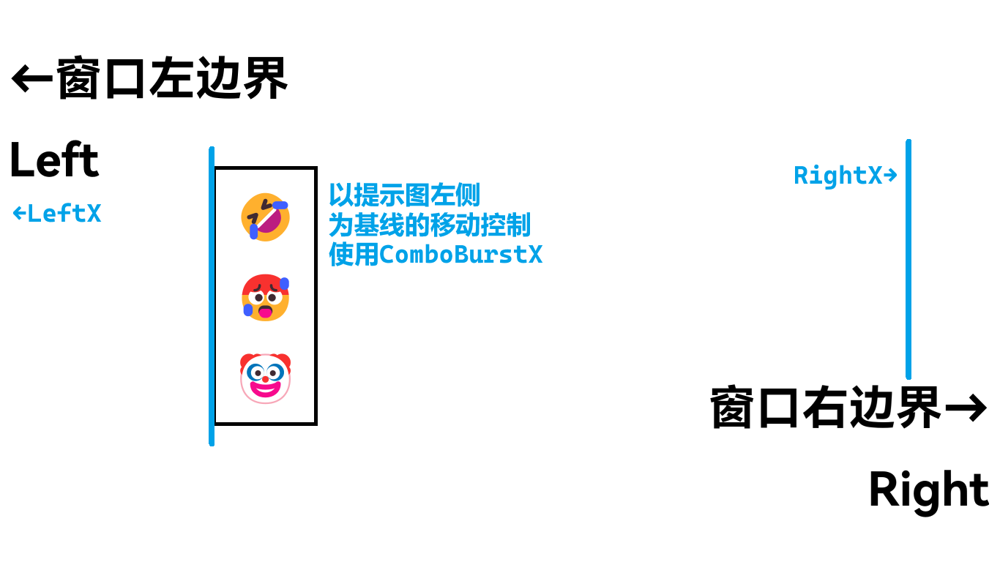

# opsu! 开发-定制动画

最近正在忙着研究 opsu! 的源码，并在其上做一些更改与优化。其中值得关注的一个点就是：**界面动画**。<!-- more -->

原仓库版本中，从主界面到按钮菜单的转场显得比较生硬：点击按钮之后，一大批按钮的菜单突然闪现，主打一个措手不及；游玩过程中，连击提示图以一种*线性*的方式向中间滑出，然后才渐隐，有些过于不自然了。

理想情况下，我们需要的是像 osu! 一样丝滑的小动画：界面变暗，按钮渐隐渐现；提示人物优雅滑出，慢慢隐藏。

下面的问题就在于，从理想到现实，该如何做。

## 控制机制

我花了一点时间搜索文件，研究 opsu! 中动画的控制机制。

在 opsu! 中（多数其他游戏也应相同），对象的动画是由**函数**与**表达式**控制的，它们负责：

- 计算元素的 X / Y 坐标值
- 控制元素大小、透明度、旋转（如果有）
- 如有可能，裁剪元素
- 更新元素状态

在 opsu! 的代码中，就有专门用于处理动画的[类](https://github.com/CloneWith/opsu/blob/main/src/itdelatrisu/opsu/ui/animations/AnimatedValue.java)。

### 动画函数

由于程序不可能做到每毫秒都进行处理，因此引入一个参数 `delta`，根据两次处理间时间的变化量对元素属性做出更改。一般情况下，`delta` 值小到难以察觉，而动画过程取决于函数*表达式*的写法。在 opsu! 中，对应着 `AnimationEquation` 枚举，其中的每个项都有专用的计算函数：

```java
/**
 * Calculates a new {@code t} value using the animation equation.
 * @param t the raw {@code t} value [0,1]
 * @return the new {@code t} value [0,1]
 */
public abstract float calc(float t);
```

其中一个项目 `IN_ELASTIC` 动画对其扩展如下：

```java title="AnimationEquation.java"
public enum AnimationEquation {
    /* Elastic */
    IN_ELASTIC {
        @Override
        public float calc(float t) {
            if (t == 0 || t == 1)
                return t;
            float period = 0.3f;
            t = t - 1;
            return -((float) Math.pow(2, 10 * t) * (float) Math.sin(((t - period / 4) * (Math.PI * 2)) / period));
        }
    },
}
```

除此之外，通过对参数 `t` 范围与取值的把控，还可以实现更复杂的多阶段动画等等，与我们常遇到的分段函数类似（~~所以说要好好学数学~~）。

### 流程控制

opsu! 的源码中，原作者将动画的控制分得比较明确，主要流程代码在 `AnimatedValue` 类中实现。

更新函数 `update` 多数时间都在执行：

```java
public boolean update(int delta) {
    int newTime = Utils.clamp(time + delta, 0, duration);
    // "Time" defaults to 0
    if (time != newTime) {
        this.time = newTime;
        updateValue();
        return true;
    }
    return false;
}

private void updateValue() {
    float t = eqn.calc((float) time / duration);
    this.value = base + (t * diff);
}
```

基本的逻辑：

1. `time` 表示动画已进行时间，初值为 0
2. 动画进行区间：`0 <= time <= duration`
3. 接收到传入的 `delta` 值，`clamp` 函数保证待定时间在范围内
4. 除非动画结束返回 `false`，其他情况下均会进一步调用函数 `updateValue()` 更新
5. 上述函数用 `time / duration` 传入动画进度，按表达式值（作为系数）传出数值
6. 绘制函数依据传出值更改元素

拿 opsu! 的按钮菜单界面举个例子，使用了弹跳动画：

```java
private static final float OFFSET_WIDTH_RATIO = 1 / 25f;
float center = container.getWidth() / 2f;
float centerOffsetX = container.getWidth() * OFFSET_WIDTH_RATIO;
centerOffset = new AnimatedValue(700, centerOffsetX, 0, AnimationEquation.OUT_BOUNCE);
```

## 连击提示图动画

连击提示图算是动画控制中比较高级的存在，从它的特性不难得出。

- 会从屏幕左右两侧任一出现
- 提示图顺序/随机显示
- 提示图从一侧滑出，然后渐隐

opsu! 最初实现的是线性滑入的动画，重写是因为个人对这个方式不太满意。

### 图像定位



为编程方便（以及继承原有逻辑），我们使用提示图的左边缘作为定位线，与图像宽度一同确定其水平位置。竖直位置其实没什么好说的，默认情况下竖直居中。

考虑到两侧出现的原因，图像最终会停止在：

- `LeftX`，即窗口的左边缘
- `RightX`，是窗口宽度减去图像宽度

### 提示图次序

按照提示图的命名约定，在提示图首次弹出前，会先将序号随便取个值占位：

```java
/**
 * Clears all data and re-initializes object.
 */
public void clear() {
    // Initialization...
    comburstIndex = -1;
    // Next steps...
}
```

在此之后读取图像并将其装入数组 `comboBurstImages = new Image[] ...`。

### 动画处理

在新绘制提示图前，需要检查有没有连击图正在显示中，以免冲突。条件：

- 提示图已初始化 (`comboBurstIndex != -1`)
- 提示图透明度大于 0

若满足，则会继续处理当前提示图。

```java
// combo burst
if (comboBurstIndex != -1 && comboBurstAlpha > 0f) {
    Image comboBurst = comboBurstImages[comboBurstIndex];
    comboBurst.setAlpha(comboBurstAlpha);
    comboBurstImages[comboBurstIndex].draw(comboBurstX, height - comboBurst.getHeight());
}
```

在连击增加时，会先判断是否达成里程碑，而后根据设置，确定下个连击图的序号与起始位置（在哪一侧出现）。

```java
/**
 * Increases the combo streak by one.
 */
private void incrementComboStreak() {
    combo++;
    comboPopTime = 0;
    if (combo > comboMax) comboMax = combo;
    // combo bursts (at 30, 60, 100+50x)
    if (Options.isComboBurstEnabled() && (combo == 30 || combo == 60 || (combo >= 100 && combo % 50 == 0))) {
        if (Options.getSkin().isComboBurstRandom())
            comboBurstIndex = (int) (Math.random() * comboBurstImages.length);
        else {
            if (combo == 30) comboBurstIndex = 0;
            else comboBurstIndex = (comboBurstIndex + 1) % comboBurstImages.length;
        }
        comboBurstAlpha = 0.8f;
        if ((comboBurstIndex % 2) == 0) comboBurstX = width;
        else comboBurstX = comboBurstImages[0].getWidth() * -1;
    }
}
```

接下来就是一大堆史山代码，处理提示图的动画（移动与透明度）。

```java
// combo burst
if (comboBurstIndex > -1 && Options.isComboBurstEnabled()) {
    // We use a base X value to avoid division by zero.
    int BurstWidth = comboBurstImages[comboBurstIndex].getWidth();
    int baseX = width / 40;
    int rightX = width - BurstWidth - baseX;
    double XDelta = delta / 2f;
    if (comboBurstX < baseX) {
        // Appearing from left, from comboBurstX to leftX
        comboBurstX += (float) (XDelta * GameImage.getUIscale() * (baseX - comboBurstX) / BurstWidth);
        // 强制重新定位（）
        if (comboBurstX > baseX) comboBurstX = baseX;
    } else if (comboBurstX > rightX) {
        // Appearing from right
        comboBurstX -= (float) (XDelta * GameImage.getUIscale() * (comboBurstX - rightX) / BurstWidth);
        if (comboBurstX < rightX) comboBurstX = rightX;
    }
    // 我们用 *Portion 两个变量确定动画进程，在动画即将结束时让图像渐隐
    float leftPortion = (baseX - comboBurstX) / BurstWidth;
    float rightPortion = (comboBurstX - rightX) / BurstWidth;
    if (comboBurstAlpha > 0f && (leftPortion <= 0.45f && leftPortion >= 0f) || (rightPortion <= 0.45f && rightPortion >= 0f)) {
        // alpha = 1 / x, 0f -> insivible
        // float AlphaDelta = 1.0f / delta;
        // comboBurstAlpha -= AlphaDelta;
        comboBurstAlpha -= (delta / 1200f);
        // 透明度有非负限制，强制设置为 0
        if (comboBurstAlpha < 0f) comboBurstAlpha = 0f;
    }
}
```

通过这样的方法，可以初步实现基本的提示图效果。学会了吗？来动手试试看吧\~
