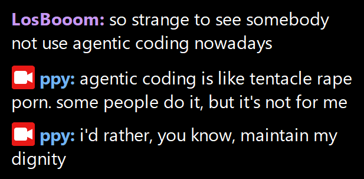
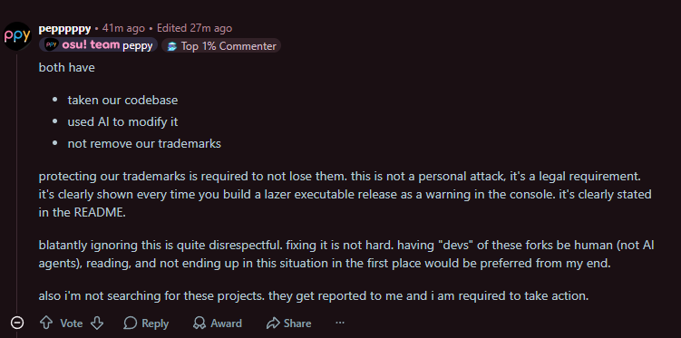
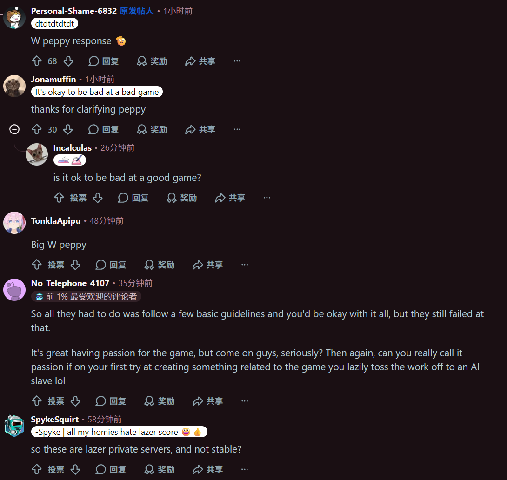

# 音游主理人的七宗罪·之三宗罪

在天主教中，**七宗罪**对应人类道德堕落根源的七种精神性罪恶分类体系，强调驱动恶行背后的原始动机，是一种原始而简练的分析体系。

**osu?** 是一款于 2007 年创建的免费音乐节奏游戏。它的核心玩法是跟随音乐节奏，在屏幕上点击圆圈、滑动滑条、旋转转盘，以获取高分。游戏以“节奏只需一次点击” (rhythm is just a click away) 为理念，发展至今已成为全球音游圈最具影响力的作品之一。

那么这篇文章就针对 osu? 主理人在打理游戏与社区生态过程中的各方面表现，总结出音游主理人的七宗罪。然而在经过一段时间的分析后，发现传统的七宗罪分析体系对于他依旧过于繁杂，同时存在重合的地方，此处将其简化为**三宗罪**。

## 第一宗

开源不敬、为人不端之罪。

对于一个合格的音游主理人来说，最无法接受的罪责。

开源文化源于黑客对智慧成果共享、自由的追求。早在 Linus Torvalds 创建 Linux 系统以来，开源文化便盛极一时，至今已经融入了信息、教育、健康等各大领域，甚至是哲学范畴。支撑这一文化的**开源精神**，其核心正是**自由**、**共享**与**协作**。

osu? (*lazer*，stable 源码并未主动公开) 仓库的源码在 GitHub 平台上开放，其最早的提交记录可追溯到 2016 年 8 月的 `Initial commit.`，为其后的发展奠定了基础。在此之后，众多社区成员为 lazer 做出问题报告、功能建议、代码变更等在内的贡献，为 lazer 客户端添加了丰富的功能。

然而 lazer 得到断崖式上升的发展，还是 25 年下半年后的事。在将主页的按钮重新设计后，lazer 被大量新入坑 osu? 的萌新所下载安装。虽说 lazer 相比 stable 在一些地方确有好处，但误导性的按钮设计正是无形中剥夺了用户的选择权。从我个人看来，更希望恢复原有的版本左右并列设计。

从 25 年后开始，面对 AI Coding 的推波助澜，主理人的傲慢真正显现出来。

若在 AI 刚开始发展的 25 年初提出这样的论调，似乎还能为人接受。但这是 26 年，加上所有开源仓库都会有经验不足的贡献者，即便个人不偏好使用 AI，也应对 AI 辅助的代码有一定的宽容度。面对 AI 发展的趋势选择固执，尊严何在？只是在试图稳定自己的地位的失败尝试罢了。

[这个议题](https://github.com/ppy/osu/issues/38552)利用 DeepSeek 的协助，找出了长久存在的颜色计算问题。在原作者发布这个议题后，团队所作的不是感谢，不是解决这个问题，而是先锁定了帖子，并且编辑：

> Our team believes in human contributions. Any contribution – be it an issue report or a pull request – which is created by, documented by, or aided by AI/LLM usage will typically be closed and locked without further discussion.

在网络安全界，使用 AI 辅助进行渗透测试与软件修复已不是稀奇之事。若拒绝带有 AI 内容的 PR 是一般错误，拒绝 AI 协助找出的问题便是不敬之罪——对任何问题的忽视，无论由人类找出或是 AI 分析得出，都是一桩罪过。

在这之后，团队成员竟自己通过 [commit](https://github.com/Zezo-Ai/osu/commit/2dafddaaf6080105a57aefae3ebf050a96fcefd1) 解决了该问题，只字不提该议题背后的分析过程，实为讽刺...*他们并没有动脑*，意气行事代替了思考。

## 第二宗

无端愤怒、歪曲事实之罪。

这里先叠层甲，我是 g0v0 私服的一般贡献者兼不活跃成员，对这件事比较了解是很正常的，不明事实的朋友请不要急着反驳我。

2026 年 8 月 10 日，咕服迎来了它的开服一周年纪念日。团队从零开始搭建基础设施，通过现有的服务器行为构造出后端实现，前端、后端代码完全开源，同时支持 Relax 模组单独排行与表现分计算（曾经还支持其他自定义游戏模式），实现了自托管、可扩展 osu? 私人服务器自由。

然而在 8 月 12 日，我们收到了来自上游主理人的 DMCA Takedown Notice：

> Cease and desist: Trademark usage
>
> This client is being distributed as a binary containing direct usage of the "osu!" trademark in text and image form, completely ignoring the builder instructions and trademark law.
>
> I cannot even find a contact email to send this to. I will resort to contacting the webhost if no action is taken within 24 hours.
>
> REQUIREMENT: Remove all osu! resources and references to the "osu!" name.
>
> REQUIREMENT: Stop using osu-resources if they are being used as part of a commercial project ("donations" count as commercial unless you're registered as a not-for-profit, and even then it's debatable).

这一点针对 `osu-resources` 包，其使用 [CC BY-NC 4.0](https://creativecommons.org/licenses/by-nc/4.0/legalcode.zh-hans) 条例，不允许商业化使用。对于 NC 这一点，条款明细指出：

> 非商业性使用： 指该使用的主要意图或者指向并非获取商业优势或金钱报酬。为本公共许可协议之目的，以数字文件共享或类似方式，用授权作品(Licensed Material)交换其他受到著作权与类似权利保护的作品(material)是非商业性使用，只要该交换不涉及金钱报酬的支付。

我们内部审查了服务器机制，并无明面上的商业化行为发生。唯一被其视为”把柄“的是服务器开放的捐赠机制，即使这是自愿捐献，不涉及解锁特殊限制功能。

CC领域专家林诚夏对此有[专门分析](https://tw.creativecommons.net/2022/05/28/essay-charging-for-free-at-the-early-stage-is-not-equal-to-noncommercial-understand-the-cc-noncommercial-analyses-in-the-real-life-practice/)：

> "若善用CC-NC素材来提升点阅或关注，而实际取得金流的可行方式，纯然是依照没有拘束关系、没有对价关系的捐款模式，则是符合非商业性的。这是因为CC-NC的素材应用与捐款的获得，并没有因A则B的关系，毕竟捐献是一种随喜随缘、无法强迫发生的资金浥注模式。"

Stack Exchange 上的[法律讨论](https://opensource.stackexchange.com/questions/14037/can-i-accept-donations-under-cc-by-nc-sa-4-0)也指出，关键在于捐赠是否是服务的（主要）目的：

> "If you're running the site for its own sake, and donations are just meant to defray costs, then you might have a stronger legal leg to stand on... What this really comes down to... is how 'primary' your donations would be."

从这个角度分析，主理人的诉求存在很多不合理性，因其是从主观角度进行 DMCA，并未全面分析我们的实际盈利与具体情况。无论如何，在这之后，我们立即清理了 Fork 仓库，并发布了相关声明，全面停止了部署的私服服务。

但在 Reddit 的 osu? 论坛，我们遗憾地发现另一种论调：

尽管如此，“使用 AI”并不是 DMCA 的合理原因，官方避重就轻、转移话题，精心酝酿了一桩莫须有的攻击。从这样的视角，一切似乎都很合理，因此评论区的舆论自然是一边倒的：

相关者不止一位，另一位私服的管理员也收到了这样的 DMCA 请求。这里就不再赘述了，颠倒黑白正是一大罪过，且我们尚不明确他的真实意图何在。

## 第三宗

欲望放纵、逃避现实之罪。

在这里举 osu?(lazer) 开发进度更新视频为例，切作臊子展开讲讲。

**osu中文搬运**是活跃在 B 站，由一群志愿者运营的人工视频翻译账号，专门推送 osu? 官方的 `lazer updates` 系列视频。出于网络环境限制，我们以该账号的稿件标题为参考，分析官方宣传的重点内容，从最早一期视频“[决定 lazer 的未来 20240413](https://www.bilibili.com/video/BV1Hz421C7ny)”开始：

社区投票，去掉 logo 中的点；PP 不上榜指示，暂停恢复的衔接，编辑器性能...一批有用的功能。摘取热门评论区

> osu给我的第一印象就是开放...
>
> 装arch linux打开discover，第一个看见的游戏就是flatpak上的osu。
>
> 真正关心玩家的游戏 osu

你可能会觉得这个游戏挺好的。再看看下面一点的评论：

> 移动端优化呢？降低了性能需求还是打算扔给以后soc的性能进步？
>
> 问就是在路上，osu!framework 的移动端支持多年来一直处在少人维护的状态
>
> 移动端支持。现在点击游玩还没有很好的支持，进一步还有对于触控笔的笔模式的支持。

很明显，osu? 的开发重心是有问题的。

接下来略去具体内容，盘点一下 osu? 从 24 年到现在都在做什么：

- 24 年：谱面编辑器、音频延迟、PP 算法、PP 算法更新余波
- 24 年 12 月：**日本特别版**
- 25 年 1-9 月：新手游戏体验、谱面搜索、选歌 V2、判定同步、经典版皮肤
- 25 年 10 月：匹配模式 Quick play
- 25 年 12 月：替代匹配模式
- 26 年 3 月：排位模式 Ranked play
- 26 年 5 月：排位赛核心问题
- 26 年 6 月：分数重算
- 26 年 7 月：还原 stable 行为、按键绑定等

是否发现有不太对的地方？从 25 年下半年开始，开发团队开始偏向多人游戏新功能的开发，旨在增添“游戏乐趣”。但现有的问题呢？

如果去 GitHub 仓库页的[议题](https://github.com/ppy/osu/issues)或者[拉取请求列表](https://github.com/ppy/osu/pulls)看一眼，便能发现问题所在。截止写稿日晚九点，开放议题量达到 1514 条（池沼），由别人（不是开发团队成员）提出的最早且最火热议题“[supporter 与非 supporter 在聊天里没有区别](https://github.com/ppy/osu/issues/2500)”经过了八年，依然在等待设计；未合并的拉取请求 376 个。

结合 osu? 圈玩家的普遍诉求：音频、移动端支持，我们发现一个极其硬核的[使用 BASS 解决音频标准化](https://github.com/ppy/osu/pull/27793)的 PR，有三个对框架的前提 PR，均未合并——没有团队成员审阅；这个 PR 也是如此。就这样许多本应能对 lazer 做出积极改变的 PR 都慢慢过期了，被埋没在滚滚的 commit 长河中。

转而分析 25 年下半年开始，团队开发新多人模式的阶段，很多贡献者的 PR 也是这样被忽略；有些好在收到了团队成员的初步 review，但进一步更改无人在意，PR 保持开启，至今仍未被合并。

为 osu? 添加美好的功能固然重要，但若出于这一点原因，将团队路线上的更改列为最高优先级，志愿者的其他贡献作为“低优先级”一笔带过，甚至卡 review、卡 merge，实在是一桩罪过。要知道短时间维持的虚伪图景不会长久持续，背后地狱般的现实总会烧穿这层弱不禁风的窗户纸。

## 后记

当然我们无法否认的是，这位音游主理人在游戏开发的前期，确实做出了相当的贡献，比如凭一己之力做出了《精英节拍特工》在 PC 上的复刻版，最终发展成了独立游戏；同时 lazer 面向社区开源，营造了丰富的游戏体验等等。但这些出色的表现仅限于一段时间前，并且他最近的表现影响着实更大，功远远无法弥补罪，我们也只能无奈做出将其七宗罪公之于众的决定...

本文与现实中的 osu!（音乐节奏游戏）没有任何关联。This post is not affiliated with osu!, a rhythm game.
