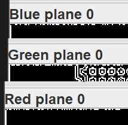
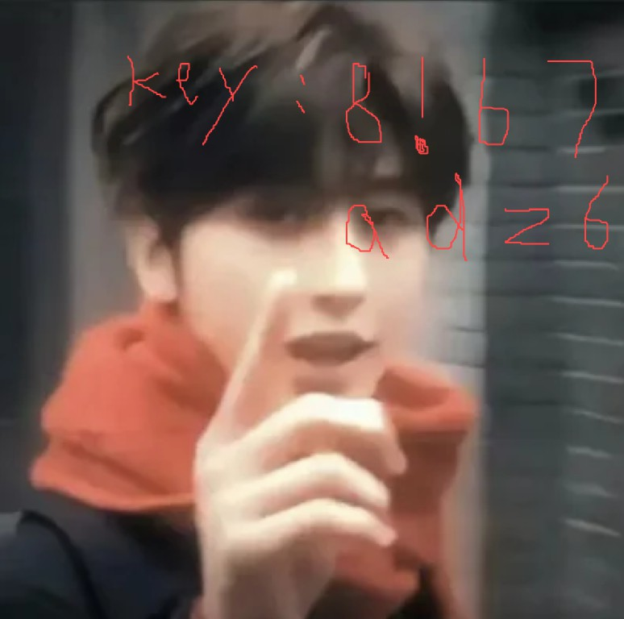

# BuildCTF - Misc

总的来说，这届 BuildCTF Misc 部分的题目还是对新手相对友好的，不过也有一些比较抽象深刻的题目就是了...

## 老色批

说实话，你是不是老色批？！

Misc 的隐写题。熟悉图像隐写的各位师傅应该能猜出来了，与 **LSB** 隐写方式相关。其主要的特征是在图像的某一个颜色通道上能看到有规律的点线像素。



使用 StegSolve 的 *Data Extract* 工具，选定这几个通道，提取模式设为 *LSB First*，可以提取出一段 Base64 编码，解码后即可得到 flag。

## 一念愚即般若绝，一念智即般若生

解密？解密！

比较简单的嵌套加密题。

- 第一个文件是*阴阳怪气编码*，解码后可以得到`佛道皆古法`压缩包的密码
- 其中文本文件使用的是*与佛论禅编码*，解码后会得到一段*天书编码*文本
- 天书解密后，得到的是一段 *Base58* 编码，解码即可获得 flag。

## HEX的秘密

”怎么是乱码“

简单的文本编码题。根据字符组成与题目描述，猜测是十六进制 (HEX) 形式。

解码后发现似乎是一段乱码，但是也在常规字符范围内，考虑是进行了异或 (xor) 处理。利用 CyberChef 的 Magic 推测功能，可以得到 flag，异或密钥是 `80` 十六进制。

## what is this?

题目中给出的文本是一串 `01` 字符串，考虑是二进制编码，解密后：

> ccc,ppppp,ccppcp,p,cccc,cpppp,ccc,ccppcp,cpppp,ccccc,ccppcp,pp,ppppp,cpc,ccccc,c,ccppcp,pcpc,ppppp,pcc,c,ccppcp,pcpcpp,pcpcpp

结合字符出现的形式（只有两种字符，有分隔符分组，每组不超过 6 个字符），可以考虑是摩斯电码，将 `c` 替换成 `.`、`p` 替换成 `-` 即可解码出 flag。

## 我太喜欢亢金星君了

- 火眼精金，一眼盯帧(结果用BuildCTF{}包裹)

一般隐写题。在图像编辑器中打开附件（GIF 文件），发现图像都是由几种相同的帧构成：两个人物图像，以及黑白颜色图像。由总帧数推断，可能是摩斯电码。

为了辨别方便，可以使用 Python 脚本分离出 GIF 图像的所有帧：

```python
from PIL import Image

def extract_gif_frames(gif_path, output_folder):
    # 打开GIF文件
    with Image.open(gif_path) as img:
        # 获取GIF的帧数
        frames = []
        while True:
            try:
                frames.append(img.copy())
                img.seek(img.tell() + 1)
            except EOFError:
                break

        # 保存每一帧为单独的图片文件
        for i, frame in enumerate(frames):
            frame.save(f'{output_folder}/frame_{i+1}.png')

gif_path = 'output.gif'
output_folder = 'extracted'
extract_gif_frames(gif_path, output_folder)
```

然后按每帧对应关系得出摩斯电码：

- 黑色图像是信号之间的分隔
- 白色图像用来分隔字符
- 两个人物图像分别对应 `.` 与 `-`

## 如果再来一次，还会选择我吗？

会永远选择他的，对吗

题目给出了一个损坏的 PNG 文件。经过观察，发现文件中的所有奇数列与偶数列数据都对调了，可以使用十六进制编辑器手动调换列数据（或者写脚本），得到正确的文件。



由此得出压缩文件密码。解压出的 `flag` 文件使用 Base64 编码。由于长度原因，可以使用 Python 脚本解码处理并提取出文件：

```python
import base64

def base64_file_to_file(input_file_path, output_file_path):
    try:
        with open(input_file_path, 'r') as file:
            base64_string = file.read()

        binary_data = base64.b64decode(base64_string)

        with open(output_file_path, 'wb') as file:
            file.write(binary_data)

    except Exception as e:
        print(f"发生错误：{e}")

if __name__ == "__main__":
    input_file_path = 'flag.txt'
    output_file_path = 'decoded_output_file.png'

    base64_file_to_file(input_file_path, output_file_path)

```

可以得到一个被红色笔涂改的条形码，识别之后即可获得 flag。

## 四妹，你听我解释

用 `pngcheck` 对题目中给出的 PNG 文件进行检测：

```bash
c.png  CRC error in chunk IHDR (computed d073b961, expected c5a18d9c)
```

用内置图像查看器可以打开，则应该是高度问题，可以尝试稍微改大一些，从图中看到后半部分的 flag 编码。

同时，在原文件的 `IEND` 末尾能够找到额外字符，用文本编辑器打开，发现是前半部分的 flag 编码，合在一起使用*核心价值观*解码即可获得 flag。

## 四妹？还是萍萍呢？

PNG是啥？

直接打开`四妹`图像会发现底部有杂乱像素，怀疑有文件隐写。使用 `binwalk` 可以提取出一个压缩包。

题目附件中给出了 9 张二维码部分图像，手动拼接后，在公众号中回复 `password` 会获得解压压缩包的密码。

压缩包的文本文件中是一个 base64 编码的文件，解码可获得带 flag 的图像。

## 什么？来玩玩心算吧

是心算吗，真的是嘛？可能是吧

看似是计算 24，但是输入正确答案没有给出其他信息，考虑是 Python 沙箱逃逸。

尝试输入 ASCII 等等会被禁止，则可以利用 Python 可以将特殊（如粗体斜体）的 Unicode 字符作为正常字符解读的机制，使用粗体字符任意构造 payload（如 `breakpoint()` 的粗体形式），进入调试器并获取 Shell。

## Guesscoin

来玩个小游戏吧！

简单的猜硬币游戏，直接手动输入即可。

## FindYourWindows

我的桌面好像有点不对劲了

使用 `binwalk` 与 `file` 检查，难以发现可以提取的东西。结合文件的大小（2048 KB），怀疑是磁盘镜像，`key` 是密钥文件，发现能够成功打开。

为了具体探查文件，可以使用 VeraCrypt 挂载镜像，然后使用 FTK Imager 对文件系统做进一步分析。

## E2_?_21P

什么？？crc校验失败？？？？

由于没有给出密码，首先怀疑是伪加密，更改文件头后发现提示 CRC 校验失败。

为了获取正确的 CRC，可以使用 Linux 环境下的 `unzip` 尝试解压，它会提示正确的 CRC。

经过尝试之后，发现是设置的压缩方式不正确，修改为 Deflate 方式即可解压。

得到的文本文件是 BrainFuck 语言，运行后可以获得 flag。

## EZ_ZIP

有意思的压缩包

只有一张图片，尝试从中提取压缩包，发现是多层套壳，可以利用 Python 脚本递归解压：

```python
import os
import zipfile

def unzip_all(root_path, index):
    # 遍历root_path下的所有文件和文件夹
    for root, dirs, files in os.walk(root_path):
        for file in files:
            # 检查文件是否是zip文件
            if file == "layer_" + str(index) + ".zip":
                # 构建完整的文件路径
                file_path = os.path.join(root, file)
                print(file_path)
                # 使用zipfile模块打开zip文件
                with zipfile.ZipFile(file_path, 'r') as zip_ref:
                    # 解压zip文件
                    zip_ref.extractall(root)
                    # 检查解压后的文件夹中是否还有zip文件，并递归调用

for i in range(0, 499):
    unzip_all(".", 499 - i)
```

在最后的 `flag` 压缩文件中是伪加密，修改后即可获得 flag。

## 别真给我开盒了哥

请找出拍摄者所在的铁路线路名称，flag格式为BuildCTF{xx铁路}，名称以百度百科为准（要一字不差）。

由照片上 S3901 的路牌可以搜索，定位在河北省廊坊市霸州市，放大地图后可以发现北部的铁路是**霸徐线**，结合百度百科的结果，确定是**霸徐铁路**或者是**津保铁路**（后者是对的）。

## 白白的真好看

题目果然又大又白

题目中给出的 `0000000` 文本中，有大量的零宽字符等不可见字符，考虑是零宽字符隐写，使用[工具](https://330k.github.io/misc_tools/unicode_steganography.html)可以得到 flag 的第二部分。

`公众号回复雪试试呢`图像用的是汉信码编码，指向人邮异步社区的公众号，回复后得到疑似是密钥的文本。

对于 `snow.txt`，每行末尾有规律排列的空格与制表符，根据题目提示可以想到 `snow` 隐写方式。

对于 `white.docx` 文档，可以发现是隐藏文本，调整文字颜色后可以得到 flag 的第一部分。

## Black&White

太极？panda？尊嘟假嘟

题目给出了 1089 张（31x31）黑白像素图片，考虑应该是将其按顺序拼接而成，这里使用 Python 拼接：

```python
from PIL import Image

def create_grid(image_files, output_file, grid_size=33):
    # 假设每张图片都是正方形，且边长相等
    width, height = Image.open(image_files[0]).size

    # 创建一个足够大的画布，以容纳9张图片
    final_image = Image.new('RGB', (width * grid_size, height * grid_size))

    # 将图片按3x3网格排列
    for i, file in enumerate(image_files):
        # 打开每张图片
        img = Image.open(file)
        # 计算每张图片在大图中的位置
        x = (i % grid_size) * width
        y = (i // grid_size) * height
        # 将图片粘贴到大图上
        final_image.paste(img, (x, y))

    # 保存最终的图片
    final_image.save(output_file)

# 图片文件列表
image_files = []

for i in range(0, 1089):
    image_files.append(f"{i}.jpg")

# 输出文件名
output_file = 'output.png'

# 调用函数
create_grid(image_files, output_file)
```

扫描二维码获取文本，最后发现是 base45 的编码，解码后可获得 flag。
