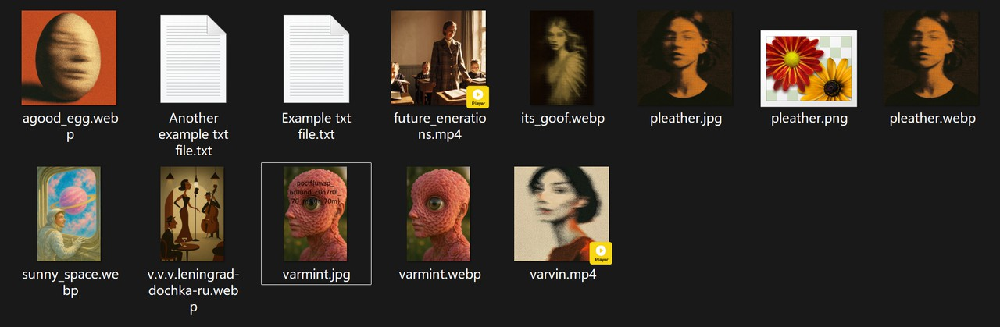
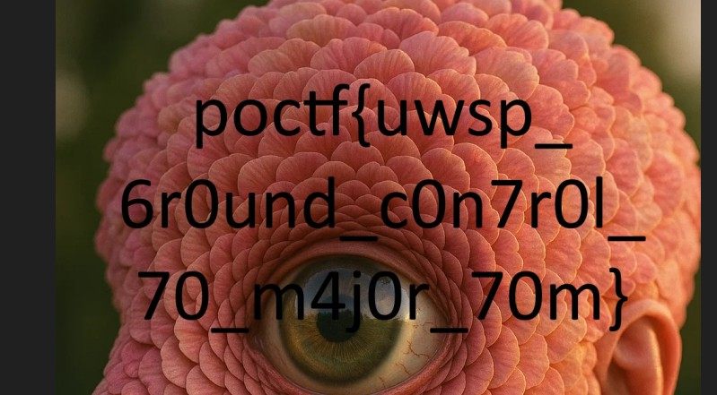
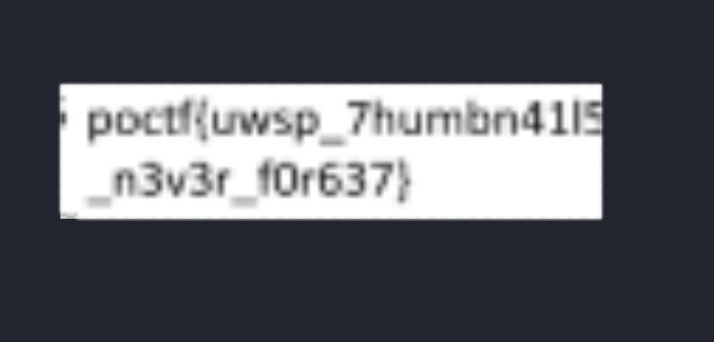
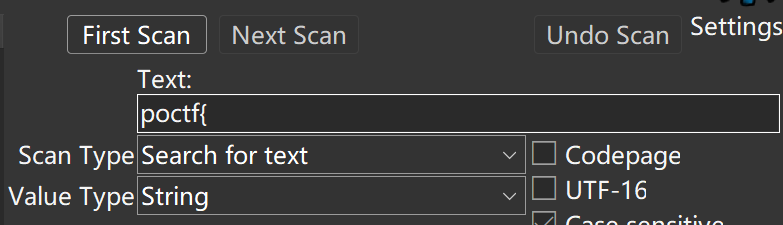
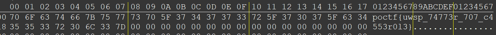

# POCTF - Forensics

## 100

### 100-1 Breadcrumbs and Coffee

::: info 题目信息

This challenge takes a few browser artifacts and leads you to the flag. The file below doesn't contain the flag itself, but it will tell you all you need to find it.

:::

更倾向于 OSINT 的取证题：SQLite 数据库文件，存有浏览器数据。

后来在 url 表中发现有一个奇怪的链接 `https://pointeroverflowctf.com/FOR100-1`，没有多余的路径，比较可疑...访问后即得 Flag：


### 100-2 Night Shift

::: info 题目信息

As a private lab in a small town, the digital forensics lab at UWSP mostly does data recovery services. It's great to be able to help the community recover their lost photos and documents. Now is your chance to help me recover mine. This archive contains some media files. Some of them are broken in more ways than one. Pull the flag out of the corrupted data for the flag.

:::

附件给出的 ZIP 文件似乎只有文件头完整，部分结构遭到了损坏...7zip 立大功！直接打开后能够提取出大部分数据。



上述文件中部分是正常可查看的，部分无法查看（这道题也友好在这里，直接将正常文件与异常文件对照比较）。使用十六进制编辑器将相同扩展名的文件内容对照，发现基本只有文件头被更改，恢复过去即可。`varmint.jpg` 中有 Flag：



得到 Flag `poctf{uwsp_6r0und_c0n7r0l_70_m4j0r_70m}`。

### 100-3 Mason, Nadir

::: info 题目信息

Network forensics became a lot more difficult when secure protocols became the norm. Not that I'm complaining - it's a good problem to have for day-to-day issues. It just so happens that some areas under Information Assurance are actually at odds with each other. As security improves, things like operations and forensics becomes more complicated. My opinion: There is a clear imperative. We have to just evolve with the times. But you won't in this challenge, because none of that is a concern for you!

:::

SMB 流量取证，传输文件较多的情况下，发现一个音频 `1760785635597.mp3`，前后听了几遍发现报的是 Flag...Flag 为 `poctf{uwsp_dr34dl0ck5_4nd_b00m571ck5}`。

### 100-4 Trace Elements

::: info 题目信息

Persistence is the key with this one.

:::

找了一圈，发现 Flag 在任务计划中（`Windows/System32/Tasks`）；Flag 为 `poctf{uwsp_1n_f0r_4_p3nny_1n_f0r_4_p0und}`。

## 200

### 200-1 Dust in the Attic

::: info 题目信息

I spent some time cleaning out the attic last spring. Long overdue. I took a few pictures while I was up there. I've been looking for an excuse to use the camera more. Hope you like them!

:::

图像没什么问题，但有一个 `thumbcache_96.db`，经过分析发现是 Windows 系统下生成的缩略图数据库文件（其中的缩略图均以 BMP 格式存储），其中记录数目有多出来的，怀疑有相关信息。使用 foremost 进行提取，额外获得一张缩略图如下：



Flag 为 `poctf{uwsp_7humbn41l5_n3v3r_f0r637}`。

### 200-2 Wintermute

::: info 题目信息

A simple memory forensics challenge for you. In this case, a file was created and named with the flag just prior to capture. A quick peak with the right tool will get you the flag.

:::

内存取证，Flag 以一般形式明文存储在内存中，搜前缀可得...

Flag 为 `poctf{uwsp_4_d3c4d3_0f_70l3r4nc3}`。

### 200-3 The Banshees of Inisherin

::: info 题目信息

A small publishing shop containerized a one-off utility called “banshee,” pushed a hotfix, and swore the secret was removed. The team pruned the container, rotated some logs, and moved on. Your job is to prove whether the secret ever truly left the system.
You should assume normal Ubuntu-like defaults and a standard Docker CE install.

:::

结合题目，附件给出的是 Docker 的数据目录，其中 `/var/lib/docker/overlay2` 是容器文件的差异目录（？待核实），可以从其中的 `diff` 目录下逐步进行探索。容易找到以下文件：

```bash
# !/bin/sh

set -eu

# Simulate "hotfix": remove the original data dir so the upper layer hides the lower content.

rm -rf /opt/app/data
mkdir -p /opt/app/data
echo "maintenance mode" > /opt/app/data/readme.txt
for i in $(seq 1 100); do echo "heartbeat $i"; sleep 0.01; done
```

猜测删除的秘密就在某个容器文件系统的 `/opt/app/data` 文件夹中。据此进一步搜索，在 `wl6hj1dcr44qb3ry0s9thfvbi` 中的对应位置找到了 `secret.db` 数据库文件，Flag 存储在其中，为 `poctf{uwsp_7h3_h00k_br1n65_y0u_b4ck}`。


## 300

### 300-1 Built Up in my Head

附件太大导致频频下载失败...

### 300-2 The Sound and the Fury

简单来说，程序在运行时需要联网从服务器下载一个 nonce 与加密的 flag，根据题目提示，Flag 应以明文形式存储在内存中。

Win11 没法直接 Dump 内存，会蓝屏（疑似触发了内存保护机制）...调试也调不明白，直接用 Cheat Engine 从内存读：设置称附加到进程之后，将扫描目标改成字符串，搜 Flag 头就行了。





Flag 为 `poctf{uwsp_74773r_707_c4553r0l3}`。
