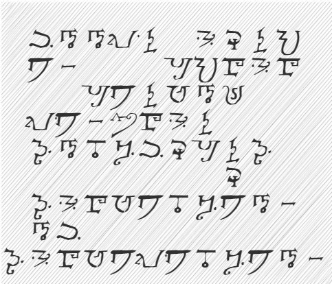
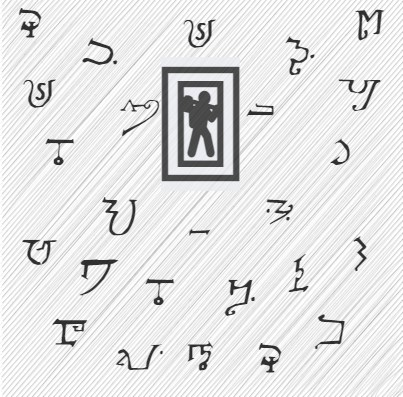
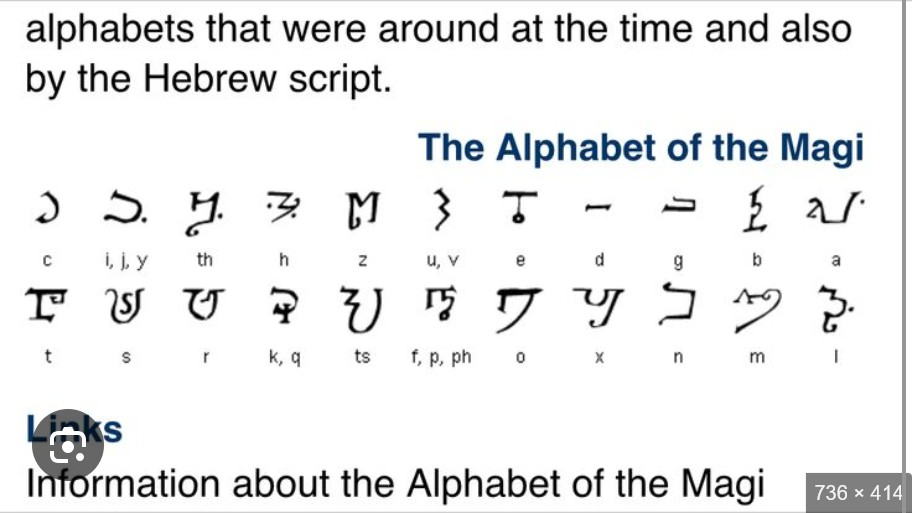
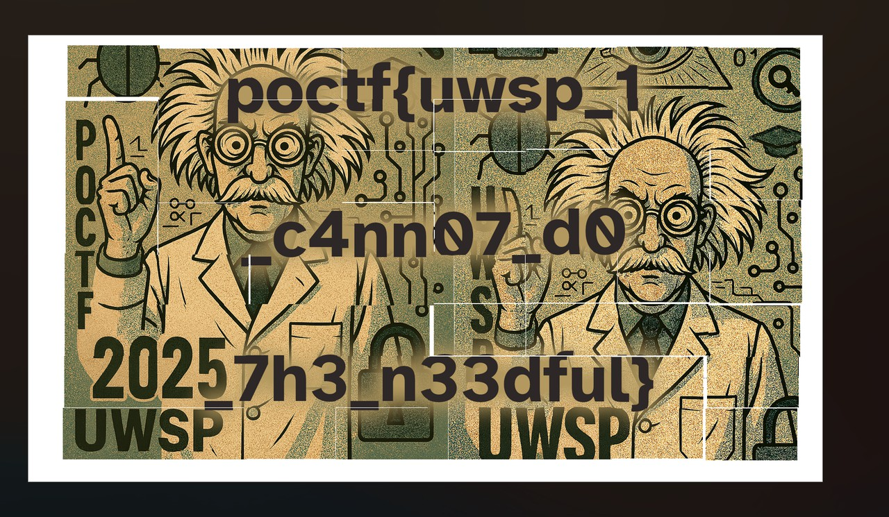
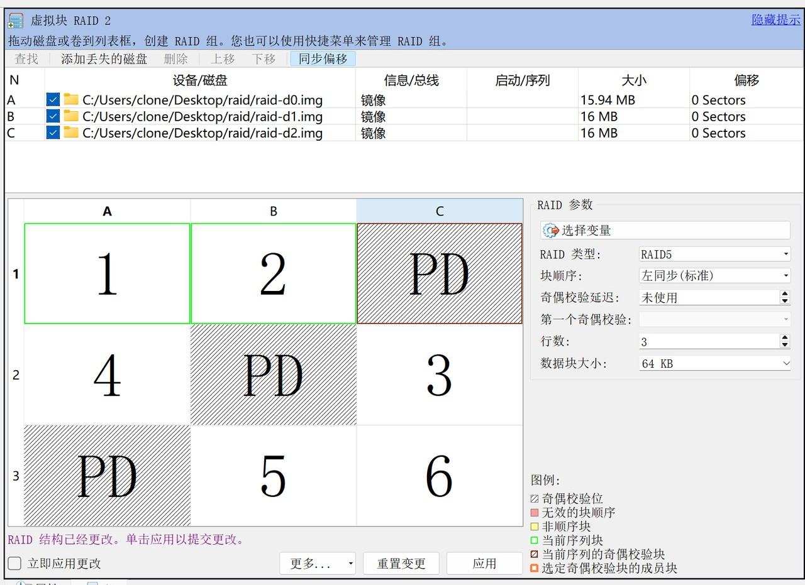
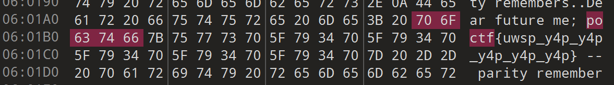

# POCTF - Misc

## 100

### 100-3 Fools Rush In

| Cipher | Puzzle |
| :-: | :-: |
|  |  |

密码使用的是 Magicode

给的 puzzle 是什么意思没看懂

## 200

### 200-? Mason, Terror Incognita

压缩包里是分块的图像，拼图得到 Flag 为 `poctf{uwsp_1_c4nn07_d0_7h3_n33dful}`。（不是很好看但PPT大法是真的方便）

从 Discord 那边看了一下，也有其他选手用 GIMP 拼出来的，效果很不错，可以试试。

### 200-3 A Maze of Twisty Little Passages, All Different

每个 Sector 中飞机的航路对应一个字符，简单模拟并拼接后即可获得 Flag `poctf{uwsp_175_4lw4y5_5unny_0n_73l3v1510n}`。

## 300

### 300-2 Clockwork Angels

SMT 求解器，AI 一把梭了。

Flag 为 `poctf{uwsp_p34c3_1n_0ur_71m3}`。

## 400

### 400 Digital Palimpsest

一开始想着从文件系统层面考虑，用题目给的信息套 RAID 模板，但是恢复不出完整的数据。

后来问了下 AI，发现其实这道题不是这么做的。RAID5 的校验逻辑是异或，因此将三个镜像互相异或，即有可能找到更新前的部分。经过尝试，将 d0 与 d2 异或后的结果中有 `poctf` 字样：

Flag 为 `poctf{uwsp_y4p_y4p_y4p_y4p_y4p}`。
