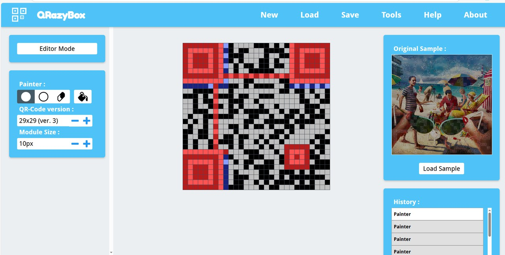
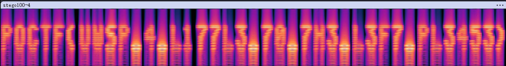
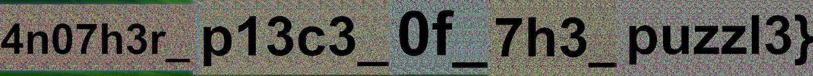
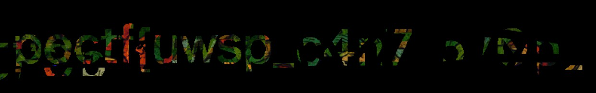
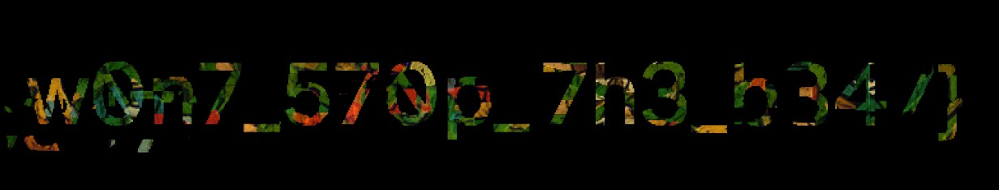
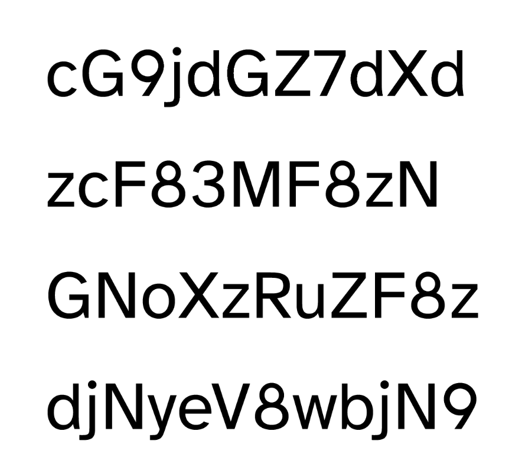
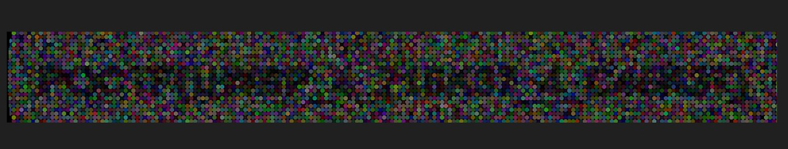

# POCTF - Stego

## 100

### 100-1 Ink Between the Lines

每行末尾有数个空格与 Tab 组合，似乎在传达某种信息。

Flag 为 `poctf{uwsp_5w337h34r7_15_7hy_c4ll}`。

### 100-3 Low Tide at Midnight

使用 Stegsolve 调一下通道，发现这张图藏了个二维码，但是依然难以辨认，没法直接被扫码工具识别，手动恢复会好一些：

扫码得到 Flag 为 `poctf{uwsp_f0r3v3r_bl0w1n6_bubbl35}`。

### 100-4 Ways and Means

附件为 JPG 文件，文件尾后有附加部分，是一个 ZIP 压缩包。提取后得到一个文件 `stego100-4`，经过分析发现是 WAV 音频文件。

打开查看波形图，得到 Flag 为 `poctf{uwsp_4_l177l3_70_7h3_l3f7_pl3453}`。

## 200

### 200-2 Through the Looking Glass

说是传统隐写，用 StegSolve 玩的时候误打误撞发现是与自身的横向位移（这题设置成 72）叠加，从而呈现出黑色文本...这里把后五张图片的结果拼起来（前面不用说了都是一样的）：

Flag 为 `poctf{uwsp_4n07h3r_p13c3_0f_7h3_puzzl3}`。

### 200-3 Dead Letter Office

发现整个图片的左右两部分特别相似，又有零碎的黑色部分，考虑是拼接字符。

用 GIMP 将左右部分使用“差异”合并，会得到黑底彩色字（实际上不推荐一下子这么做，有一部分会混在一起不好分）；然后将感觉匹配的部分剪切粘贴（使用“相加”）起来，缜密推测后得到 Flag 为 `poctf{uwsp_c4n7_570p_w0n7_570p_7h3_b347}`。

下面是拼出来的两部分，勉强能辨认的程度，凑合着看看吧...

| Part2 | Part3 |
| :-: | :-: |
|  |  |

## 300

### 300-1 Ouroboros

::: info 题目信息

🧑‍💻📸➡️👀
🧑‍💻📂🔒😏
👀🕵️‍♂️💾🎉

:::

PNG 文件尾后有附加数据，发现是一个 PDF 文件：

内容为 Base64 编码，解码后 Flag 为 `poctf{uwsp_70_34ch_4nd_3v3ry_0n3}`。

### 300-2 Blind Man's Bluff

GIF 图像没有明显的 Flag，但其中有微小变化的帧，使用“差异”将这些图层组合起来，可以得到 Flag：

`poctf{uwsp_4_716k37_4_c46r37}`？文本难以识别是这道题的一大痛点，摇了好几个人瞪了半个多小时也没看清楚...
