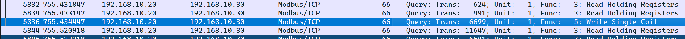
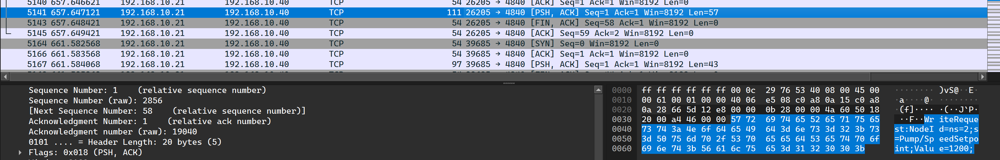
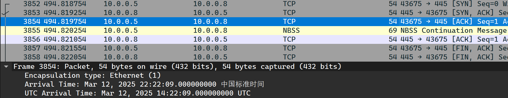
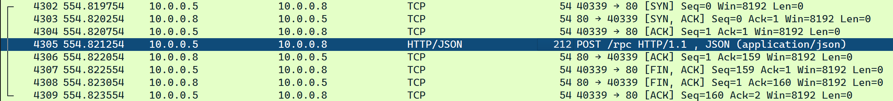
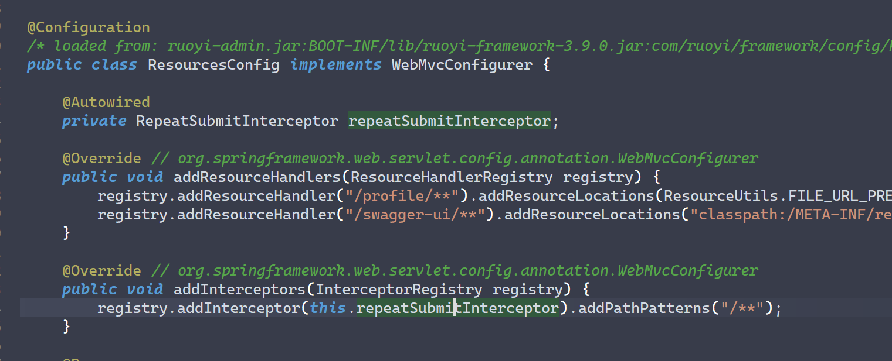
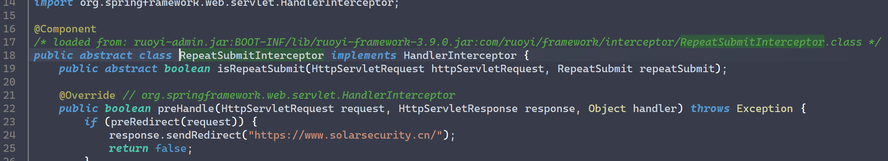

# 10 月 Writeup

## 工厂应急

这个流量包混杂了无用流量与其他地方的数据，因此需要先简单分析各个 IP 可能对应设备的用途：

- 10.0.0.2 DNS 服务器
- 10.0.0.5 某个工程机，可以外连网络
- 10.0.0.8 工程站，接受大量请求流量
- 10.0.0.9 网页服务器？
- 192.168.10.21 一个终端，向 40 发送 ModBUS 请求指令
- 192.168.10.40 可能是控制中心

### 工控流量分析

题目要求找出关泵相关信息（从稍后放出的描述更新中得知 `flag{0xtransaction_id_0xfunction_code_0xcoil_address}`），具有明显的 Modbus 特征，因此过滤出这类协议的流量。过滤后的结果中多为读取操作，只有一条写操作出现：



考虑其执行了关泵操作，故提取信息：

- Transaction ID 为 `6699 -> 0x1a2b`；
- Function Code（两位）为 `5 -> 0x05`；
- Coil Address 通常位于 Function Code 后，为 `0x000d`；

经过多次尝试，得出 Q1 Flag 为 `flag{0x1a2b_0x05_0x000d}`。

对于 Q2，先尝试在字节流中搜索 `NodeId`，得到大量的 `ReadRequest` TCP 记录；考虑到寻找写入 NodeId 的流量，转而搜索 `WriteRequest`，得到唯一一条符合要求的记录：



`NodeId` 是一个字段，Q2 的 Flag 为 `flag{ns=2;s=Pump/SpeedSetpoint;}`。

对于 Q3，搜索域名 `engws.plant.local` 的 DNS 流量。最终解析到的应是一个局域网地址，与其他工控设备在同一网段（即 10.0.0.x）；结合对 DNS 记录 IP 的搜索，确定其最终解析结果在第 2284 条记录，为 `flag{10.0.0.8}`。

### 攻击分析

Q4 要确定 HMI 到工程站上首个成功发起的时间点，于是根据条件进行过滤（最初使用的是 `((ip.src == 10.0.0.5) || (ip.src == 10.0.0.8)) && ((ip.dst == 10.0.0.5) || (ip.dst == 10.0.0.8))`，实际分析后可进一步缩减）。

前面的都是 Echo 与损坏的 NBNS 流量，不算是连接发起成功；首次发起成功应在 3852~3859 号记录处，双方成功进行了 TCP 三次握手。



按提交格式，得出 Flag 为 `flag{2025-03-12T14:22:09Z}`。

Q5 需要提交 HMI 向工程站发送 HTTP 请求的 Host 与 URI，在上述过滤的结果中进一步筛出 HTTP 协议，发现一条带 JSON 的 POST 请求。RPC 意为**远程过程执行**，较为可疑：



```http
POST /rpc HTTP/1.1

Host: engws.plant.local
User-Agent: Mozilla/5.0
Content-Type: application/json
Content-Length: 15
Connection: close

{"op":"invoke"}
```

传递的 `op` 参数很有问题，疑似用于攻击，故 Flag 为 `flag{engws.plant.local_/rpc}`。

## ruoyi

ruoyi API 遭到劫持，在一定条件下会触发跳转到外部链接。可能的原因：

- 配置文件的配置有问题
- 依赖投毒，依赖包经过了改写
- ruoyi 中可扩展的部分被利用

从附件给出的两个 YAML 配置文件来看没有明显问题，因此需要反编译 JAR 包，分析疑似劫持的方法。经过一段时间的寻找，外部依赖并未被篡改，而是添加了一个拦截器，其在 `ResourcesConfig` 类中被添加：



继续分析，拦截器类的具体位置在 `com.ruoyi.framework.interceptor.impl`：



`preRedirect` 方法定义了重定向需满足的条件，即对 User Agent 与所处分钟数进行了限制，是异常劫持的来源。

要求提交异常劫持的方法名，Flag 为 `flag{preRedirect}`。
