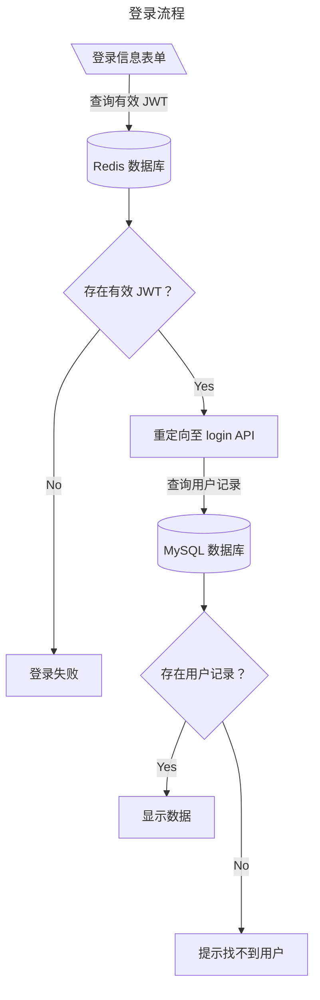

# 数据删除与恢复

## 3 - 登录令牌与数据库

::: info 题目信息

管理员利用 AI 模型设计了一个结合 Redis 和 MySQL 的交易数据查询系统，但是未对代码的安全性进行充分验证，导致 MySQL 中的用户虽然被删除但仍可以利用 Redis 中的 JWT 信息，登录交易数据查询系统。请选手下载平台提供的附件（`用户表.xlsx`），根据用户表（其中 1 个用户为管理员测试账号，可进行数据库管理）及数据库中存在的用户,判断哪些用户在被删除后仍可以利用 JWT 进行登录，将用户名按照用户表中的先后排序，并使用“_”拼接后，通过 MD5 处理后进行提交。

:::

用户表给出了九十余位用户的信息，因为没想出合适的测试方法，表里的所有数据，是我们小队里的几个人一起分工分区试出来的，花了极其可观的时间...（不过现在想起来，可能就比写脚本加上测试的速度略慢一点点）

在逐个测试的过程中，发现下列用户在尝试登录时能够进入下一级页面，但是会报错“账户未找到”：

```csv
username,password
wangguizhi,cimer15&wangguizhi
ningxiurong,Mmningxiurong13%
zhanglihua,Nn14zhanglihua^
mengpeng,Llmengpeng12$cimer
gantingting,Kk11gantingting#
```

经过简单的分析，我们推测这是由服务器端使用了**双重验证**导致的：服务器在初步验证时会先从 Redis 中搜索是否存在对应的有效（在有效期内）JWT 信息；在验证成功后会将表单参数传至 `login` 接口，由此让 MySQL 数据库验证用户信息是否存在。这个过程的图示如下：



上面的用户登陆时跳转到了验证失败的页面，说明在 Redis 中有 JWT 信息，但 MySQL 中没有相应记录，因此符合要求；

用户可以正常登录：

```csv
username,password
wangyan,Ii9wangyan!
zhangxiuyun,Gg7&zhangxiuyun
huangzhiqiang,Ee5%huangzhiqiang
wanghua,wanghuaCc3cimer#
jinguizhi,jinguizhiJj10@
guoxiaohong,guoxiaohongDd4$
wangming,Hhwangming8*
chenxin,chenxinAa1!cimer
wuwen,cimer2@wuwen
```

这些用户的信息是正常存储在数据库中的，因此也能读取出对应信息。

管理员账户（同时也是后台数据库用户）：

```csv
username,password
zhangzehua,zhangzehua@cimer..
```

登录该账户后，会显示出额外的`进入管理员后台`按钮，这样我们可以从数据库中提取出后续题目所需数据。

::: tip

数据库管理后台的登录用户与密码与上述相同。

:::

拼接字符串得到：`wangguizhi_ningxiurong_zhanglihua_mengpeng_gantingting`

**答案：** ​`8429e825242b4e9063862b78da1e46dd`​

## 4 - 借助双公钥恢复数据

::: info 题目信息

当前交易数据查询平台的 MySQL 数据库中的 `order` 库，存放了备份加密订单交易数据及公钥信息，由于私钥丢失，公司订单数据无法恢复明文信息，现需利用公钥技术尝试恢复明文数据，确保业务运营的持续性。请选手将全部的加密数据进行明文恢复，并将订单号为 202502100811 的充值前米币数量和实付金额，通过 `_` 拼接后，作为标准答案提交。

:::

## 5 - 订单数据核对

::: info 题目信息

在恢复订单数据后，发现部分订单存在账单异常问题。请选手根据恢复后的订单数据进行数据核查，找到充值米币到账数量错误的交易、米币优惠幅度高于 20% 的交易、VIP 到账天数错误的交易、实付金额错误的交易、VIP 充值优惠幅度高于 20% 的交易并统计每种错误交易类型的数量，请选手按照答案标准格式的排列顺序，通过 `_` 拼接后，作为标准答案提交。

注意：

- 充值会员 30 天为月卡，金额为 15 元.
- 充值会员 90 天为季卡，金额为 30 元.
- 充值会员 365 天为年卡，金额为 88 元.
- 米币价格与充值金额，交易换算为 1
- 计算充值优惠幅度是否高于 20% 时，使用正确的价格(充值金额或充值天数对应的金额)进行计算，不能使用现有错误实付金额计算

:::
